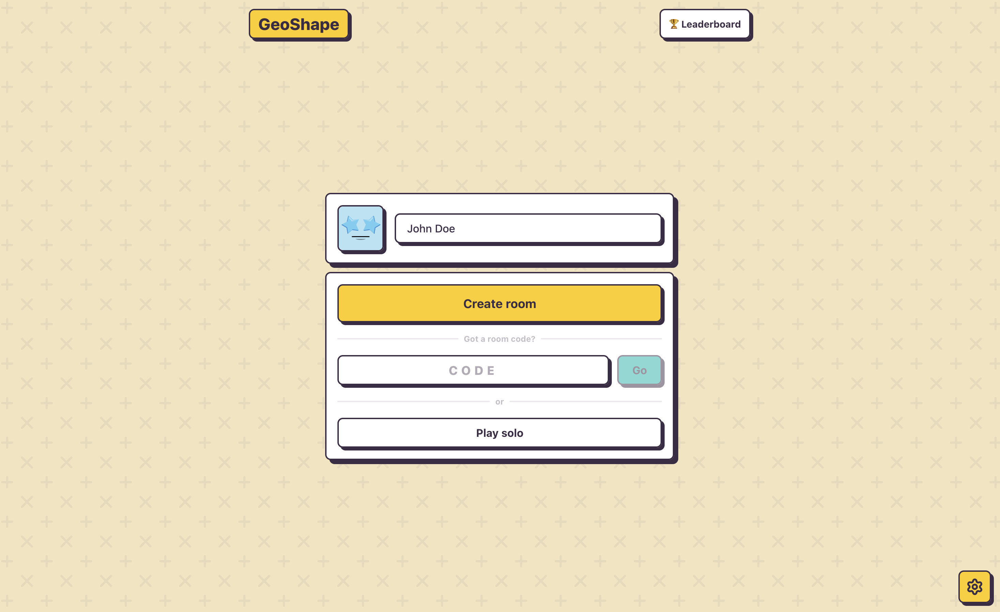
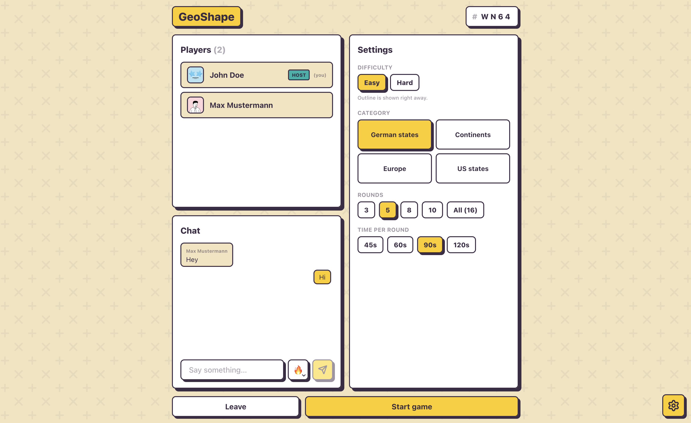
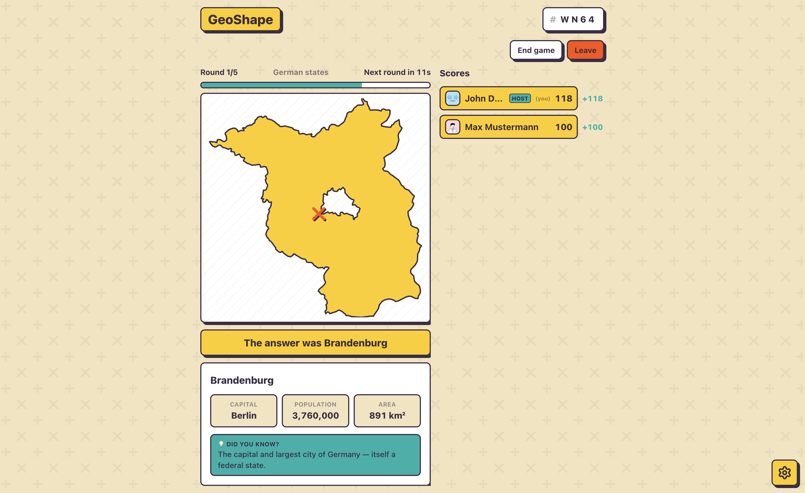
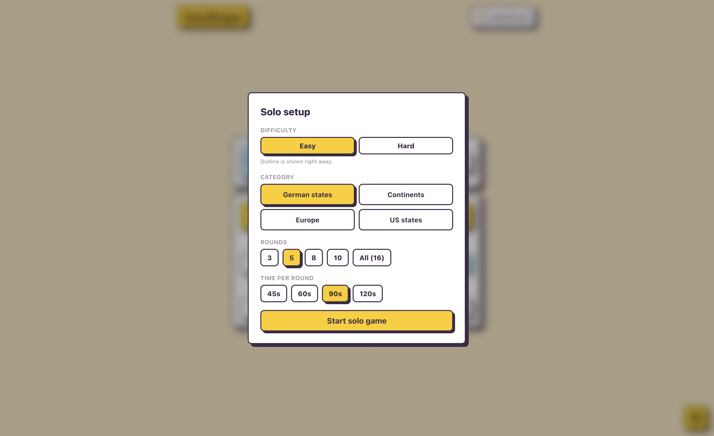

<p align="center">
  
  <h1 align="center">GeoShape</h1>
  <p align="center">
    <strong>A fast-paced real-time multiplayer geography guessing game.</strong>
    <br />
    <em>Identify countries, states, and continents from bare outlines before time runs out!</em>
  </p>
</p>

<p align="center">
  <a href="#-features">Features</a> •
  <a href="#-impressions">Screenshots</a> •
  <a href="#-tech-stack">Tech Stack</a> •
  <a href="#-getting-started">Getting Started</a> •
  <a href="#-deployment">Deployment</a> •
  <a href="#-credits">Credits</a>
</p>

---

## ✨ Features

- 🎮 **Solo & Real-Time Multiplayer** — Play practice mode solo or create custom lobbies with shareable 4-letter room codes.
- 🗺️ **Multiple Categories & Regions** — Test your knowledge on German states, European countries, US states, continents, world regions, and more.
- ⚡ **Interactive Map & Review Deck** — Inspect shapes, review missed guesses, and explore shape family clusters.
- 🏆 **Leaderboards & Statistics** — Persistent SQLite tracking for wins, games played, and high scores.
- ⚡ **No Login Required** — Jump right in by picking a display name and avatar.
- 🌐 **Multilingual** — Native support for multiple languages (English, German, etc.).

---

## 🖼️ Impressions

<table>
  <tr>
    <td width="50%"></td>
    <td width="50%"></td>
  </tr>
  <tr>
    <td width="50%"></td>
    <td width="50%"></td>
  </tr>
</table>

---

## 🛠️ Tech Stack

- **Frontend**: [Svelte 5](https://svelte.dev/) (Runes & SvelteKit), Tailwind CSS v4, Lucide Icons, GSAP & D3 Geo.
- **Backend & Real-Time**: Node.js, WebSockets (`ws`), SQLite.
- **Avatars**: [DiceBear API](https://www.dicebear.com/).

---

## 🚀 Getting Started

### Prerequisites

- [Node.js](https://nodejs.org/) (v20+ recommended)
- [npm](https://www.npmjs.com/) or [pnpm](https://pnpm.io/)

### Local Development

1. **Install Dependencies**:
   ```bash
   npm install
   ```

2. **Start Development Server**:
   ```bash
   npm run dev
   ```
   Open `http://localhost:5173` in your browser.

3. **Build & Test Production Server**:
   ```bash
   npm run build
   npm start
   ```
   Open `http://localhost:3000` in your browser.

---

## 🐳 Docker Setup

Run the application using Docker Compose:

```bash
docker compose up -d --build
```

The game will be available at `http://localhost:3000`.

---

## 🌐 Deployment

### Cloud Platforms (Render / Railway / Fly.io / Cloud Run)

- **Docker-based deployment**: Deploy directly using the included `Dockerfile`.
- **Port**: Ensure the service container listens on port `3000` (or set `PORT` environment variable).
- **WebSockets**: Ensure your host environment allows WebSocket proxying on `/ws`.
- **Database Persistence**: Mount a persistent volume at `/data` (`GEOSHAPE_DB=/data/geoshape.db`) to retain leaderboard and player statistics across deployments.

---

## 📜 Credits

- [NaturalEarth](https://www.naturalearthdata.com/) for map vector data
- [DiceBear](https://www.dicebear.com/) for avatar generation
- [Svelte](https://svelte.dev/) & [SvelteKit](https://kit.svelte.dev/)
- [SQLite](https://www.sqlite.org/)
